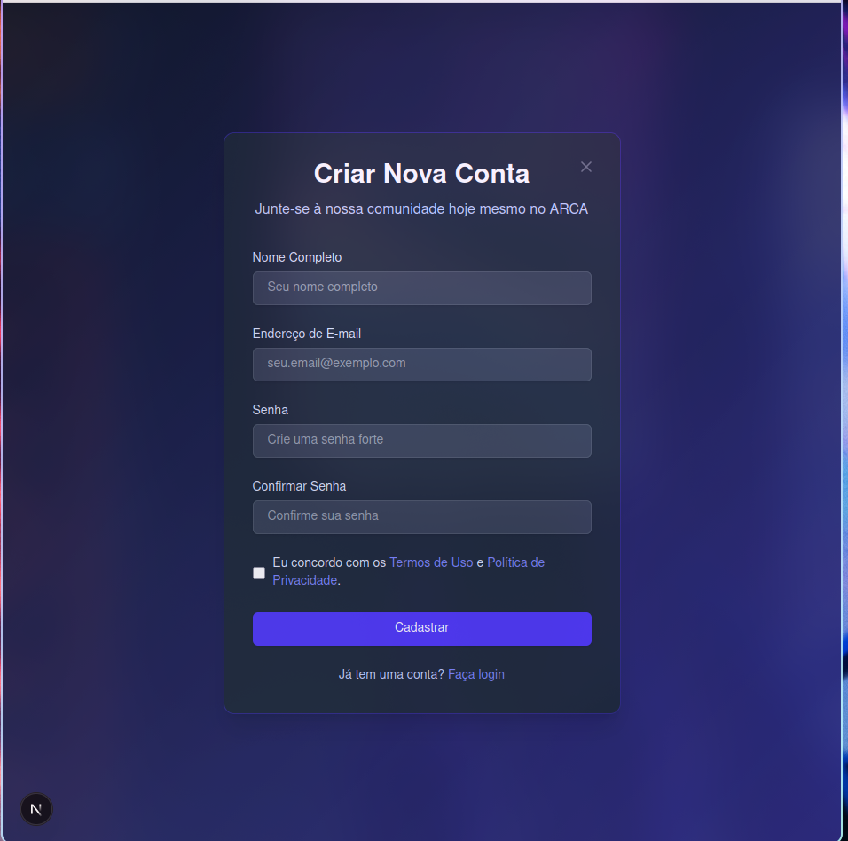
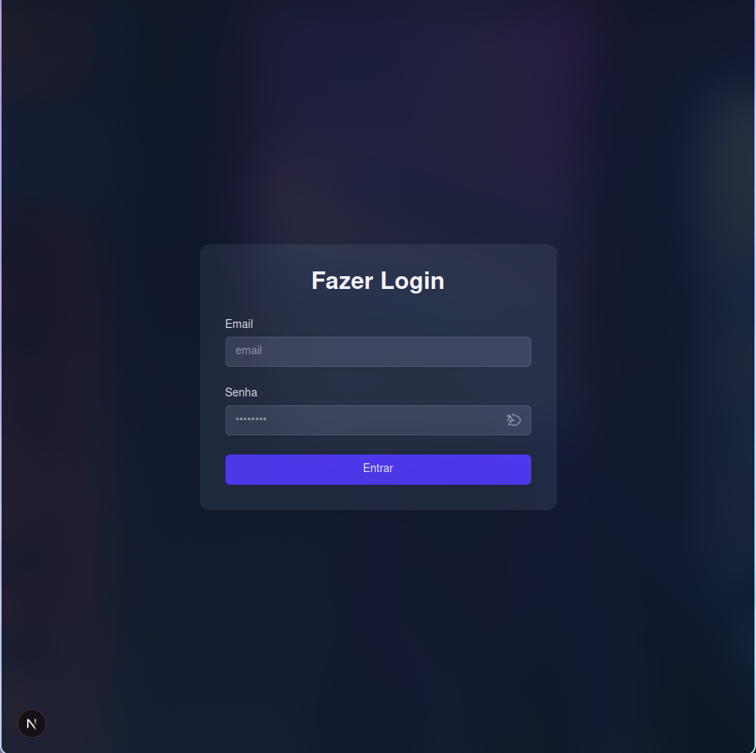

 ## Projeto ARCA 
 esse projeto que eu to criando vai ter o foco em poder gerenciar 
 pagamentos de mensalidades dos etegrates da organização de Antigomobilistas
 de Catanduva
 
 ### Tecnologias Usadas Frontend Backend
1. Frontend
 - React
 - Next.JS tanto backend
 - Typescript
 - tailwindcss

 2. banco de dados
- PostgreSQL
 
 ### Requirimentos ter no computador
 - [Node](https://nodejs.org) (v24.11.0 ou v25.1.0 LTS recomendado)
 - [Docker](https://docs.docker.com) (pode ser a versão mais atuais)
 - [npm](https://docs.npmjs.com) (se por acaso nao vier com node)
 - [Docker Compose](https://docs.docker.com/compose) (esse tbm pode ser a mais atual)
 - [Ngix](https://ngix.org) (esse pra configurar o sevidor do projeto v1.29.3 pra cima)

 ### Como rodar o projeto 

 1. **instalação**
 ```bash
   npm install
   yarn install
   pnpm install 
 ```

 2. **como colocar em produção**<br>
 `explicação tem que tar comfigurado o docker-compose.yml`
```bash
   docker-compose up --build -d  # ou sem
   docker-compose down 
```

#### Imagem das telas pra vc colaborador saber eu to criando

1. tela de inicio 


2. outra parte da tela de inicio


3. terceira parte da tela de inicio


4. tela de cadastro


5. tela de login
